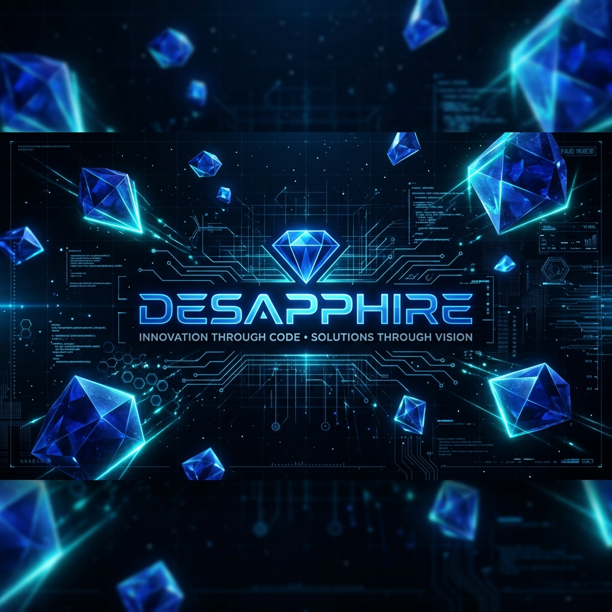

  
  
   

  # 💎 DESAPPHIRE
  ### *Engineers of Trustless Infrastructure*

  
  
  

  ---

  **Defining the next generation of decentralized ecosystems, secure verification systems, and immutable registries.**

## 🌐 Mission & Vision

At **Desapphire**, we believe that trust should be a protocol, not a promise. Our mission is to build robust, scalable, and decentralized infrastructure that eliminates middle-men and empowers users with verifiable ownership.

- **Immutable by Design**: Leveraging blockchain for permanent, tamper-proof records.
- **Security First**: Implementing multi-stakeholder signature workflows and ASBA-style financial securitization.
- **Transparency**: Open-source principles applied to critical infrastructure (where applicable).

---

## 🚀 Flagship Projects

### 🏘️ [Digiverify](https://github.com/Desapphire/Digiverify)
**The Future of Trustless Land Registry & Verification.**
Digiverify is a blockchain-powered platform for secure registration, verification, and sale of land assets.
- **Core Stacks**: Node.js, React, Ethereum (ERC-721), IPFS.

### 🧠 [Mind-Shield+](https://github.com/Desapphire/Mind-Shield-Plus)
**Intelligent Cognitive Load & Wellness Monitor.**
Mind-Shield+ monitors behavioral interaction patterns in real-time to estimate cognitive load, predict fatigue, and monitor posture.
- **Core Stacks**: Python, TensorFlow, OpenCV, Electron.

### 🛡️ [NetScan IDS](https://github.com/Desapphire/NetScan)
**Near Real-time Metadata-only NIDS.**
A specialized Network Intrusion Detection System for large-scale campus networks that combines rule-based logic with unsupervised ML and Google Gemini for semantic classification.
- **Core Stacks**: Python, ML, Google Gemini API, WebSockets.

### 📊 [Trueview](https://github.com/Desapphire/TrueView)
**Social Media Data Collection & NLP Pipeline.**
Sentiment analysis system designed to extract textual data from Reddit, process it through NLP models, and visualize emotional trends.
- **Core Stacks**: Python, NLTK/Spacy, Reddit API (PRAW).

### 🌐 [Nexora](https://github.com/Desapphire/Nexora)
**Modern Social Media Platform with AI Features.**
A feature-rich social platform with OCR text extraction, GridFS-based large file management, and real-time engagement analytics.
- **Core Stacks**: React, Node.js, MongoDB (GridFS), Tesseract.js, TailwindCSS.
- **Key Feature**: Native OCR integration and multi-format file support.

---

## 🛠️ Technical Arsenal

  
  
  
  
  
  
  

---

## 📊 Ecosystem Statistics

  
  

---

  <h3>Connect with the Future</h3>
  
Building something monumental? Reach out to us.

  

---

  
<i>&copy; 2026 Desapphire Engineering Team.</i>

