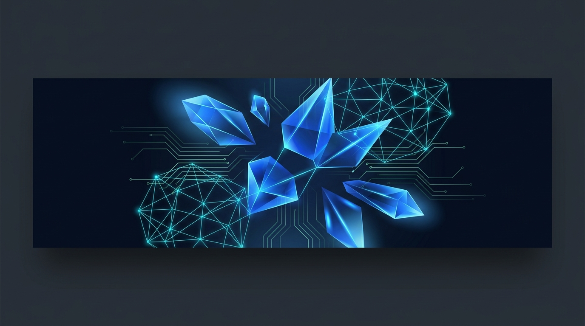

  
  
    

  
  
  
<b>Engineers of Trustless Infrastructure & Secure Automation</b>

  
Building next-generation decentralized ecosystems with security fixed into the protocol.

  

    
    
    
  

 

  

 

## ◈ ABOUT DESAPPHIRE

**Desapphire** is a group of engineers dedicated to building trustless, privacy-preserving infrastructure. We architect next-generation decentralized ecosystems, intelligent wellness telemetry, and secure, high-performance network automation. 

Through rigorous protocol design, real-time threat intelligence, and modern user-centric interfaces, we bridge the gap between complex web3 primitives and intuitive, everyday utility.

 

## ◈ FLAGSHIP PROJECTS

<table width="100%">
  <thead>
    <tr>
      <th width="55%" align="left">🌐 Project & Focus</th>
      <th width="45%" align="left">⚡ Technologies & Features</th>
    </tr>
  </thead>
  <tbody>
    <tr>
      <td valign="top">
        <h3>🏘️ <a href="https://github.com/Desapphire/Digiverify">Digiverify</a></h3>
        
<i>The Future of Trustless Land Registry & Verification.</i>

        
A decentralized application facilitating secure, tamper-proof title deed registration, ownership transfer, and automated validation of land records on-chain.

      </td>
      <td valign="top">
         
        
        
        
        <ul>
          <li>Smart Contract Verification</li>
          <li>Immutable Ledger Storage</li>
          <li>Automated Title Deed Checks</li>
        </ul>
      </td>
    </tr>
    <tr>
      <td valign="top">
        <h3>🧠 <a href="https://github.com/Desapphire/MInd_Shield">Mind-Shield+</a></h3>
        
<i>Intelligent Cognitive Load & Wellness Monitoring.</i>

        
An AI-powered application utilizing computer vision and biometric cues to monitor cognitive stress, fatigue, and overall user wellness in real-time.

      </td>
      <td valign="top">
         
        
        
        
        <ul>
          <li>Biometric Sentiment Tracking</li>
          <li>Real-time Computer Vision Pipeline</li>
          <li>Predictive Stress Modeling</li>
        </ul>
      </td>
    </tr>
    <tr>
      <td valign="top">
        <h3>🛡️ <a href="https://github.com/Desapphire/netscan">NetScan IDS</a></h3>
        
<i>Near Real-time Network Intrusion Detection System.</i>

        
A metadata-only network intrusion detection system that sniffs network packets to detect anomalies and flag intrusion signatures in real-time, preserving network privacy.

      </td>
      <td valign="top">
         
        
        
        
        <ul>
          <li>Metadata-only Packet Sniffing</li>
          <li>High-throughput API Gateway</li>
          <li>Signature-based Threat Flags</li>
        </ul>
      </td>
    </tr>
    <tr>
      <td valign="top">
        <h3>📊 <a href="https://github.com/Desapphire/TrueView">TrueView</a></h3>
        
<i>Social Media Sentiment & NLP Analysis Pipeline.</i>

        
A pipeline that ingests and processes large social streams to detect, normalize, and extract granular public sentiment and text analysis insights.

      </td>
      <td valign="top">
         
        
        
        
        <ul>
          <li>Granular Sentiment Classification</li>
          <li>Tokenization & NLP Text Normalization</li>
          <li>High-volume Data Ingestion</li>
        </ul>
      </td>
    </tr>
    <tr>
      <td valign="top">
        <h3>🌐 <a href="https://github.com/Desapphire/Nexora">Nexora</a></h3>
        
<i>Modern AI-Powered Social Platform with OCR.</i>

        
A modern social hub featuring optical character recognition (OCR) capabilities, and Gemini-based content generation for collaborative interaction.

      </td>
      <td valign="top">
         
        
        
        
        <ul>
          <li>AI-assisted Content Curation</li>
          <li>Document & Image OCR Parsing</li>
          <li>Real-time Reactive Interface</li>
        </ul>
      </td>
    </tr>
  </tbody>
</table>

 

  

 

## ◈ TECHNICAL ARSENAL

### 💻 Languages & Core

  
  
  
  

### ⚡ Frameworks & Intelligence

  
  
  
  

### 🛡️ Infrastructure & Storage

  
  
  
  

 

  

 

  <h3>◈ CONNECT WITH DESAPPHIRE</h3>
  
Exploring the frontiers of decentralized technology and secure automation.

  

    
  

   
  <code>© 2026 DESAPPHIRE // SECURING THE TRUSTLESS FUTURE</code>

